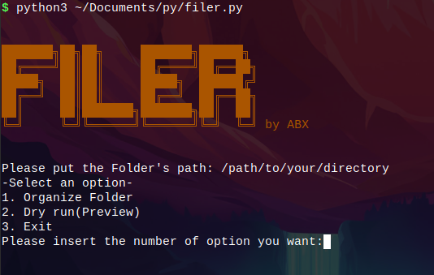

<p align="center">
  
</p>


# 📁 Filer

A simple command-line file organizer written in Python.

Filer automatically sorts files into folders based on their file extensions, making it easy to keep your directories clean and organized.

---

## ✨ Features

- Organizes files by extension
- Creates folders automatically
- Supports many file types
- Preview mode (Dry Run)
- Progress indicator while moving files
- Counts moved and skipped files
- Displays execution time
- Works on Linux, Windows, and macOS (Python 3)

---

## 📂 Supported Categories

| Category | Extensions |
|----------|------------|
| 🐍 Python | `.py` |
| 🖼 Images | `.png`, `.jpg`, `.jpeg`, `.gif`, `.webp`, `.svg` |
| 🎵 Music | `.mp3`, `.wav`, `.flac`, `.ogg` |
| 🎬 Videos | `.mp4`, `.mkv`, `.avi`, `.mov`, `.webm` |
| 📄 Documents | `.pdf`, `.doc`, `.docx`, `.txt`, `.pptx`, `.xlsx` |
| 📦 Archives | `.zip`, `.rar`, `.7z`, `.tar`, `.gz`, `.xz`, `.tgz` |
| 💻 Code | `.cpp`, `.c`, `.java`, `.js`, `.html`, `.css`, `.php`, `.json`, `.xml` |
| ⚙ Executables | `.exe`, `.AppImage`, `.x86_64` |
| 📥 Packages | `.deb`, `.rpm`, `.apk` |
| 🐚 Bash | `.sh` |

---

## 🚀 Installation

Clone the repository:

```bash
git clone https://github.com/ABX532/Filer.git
```

Go to the project folder:

```bash
cd Filer
```

Run the program:

```bash
python3 main.py
```

---

## 🖥 Example

```
Please put the Folder's path:
/home/user/Downloads

Select an option

1. Organize Folder
2. Dry Run (Preview)
3. Exit
```

Example output:

```
[1/20] ✔ photo.png -> Images
[2/20] ✔ music.mp3 -> Music
[3/20] ✔ archive.zip -> Archives

=====================================
✔ Process finished successfully!
✔ Moved: 18 files
✔ Skipped: 2 files
✔ Time: 0.45 seconds
=====================================
```

---

## 📋 Roadmap

Planned features:

- Recursive folder support
- Custom extension configuration
- Colored terminal output
- Logging
- Undo last operation
- GUI version

---

## 🤝 Contributing

Contributions, suggestions, and bug reports are welcome.

Feel free to fork the repository and submit a Pull Request.

---

## 📄 License

This project is licensed under the GNU GPL v3 License.

See the LICENSE file for more information.

---

Made with ❤️ by ABX532
